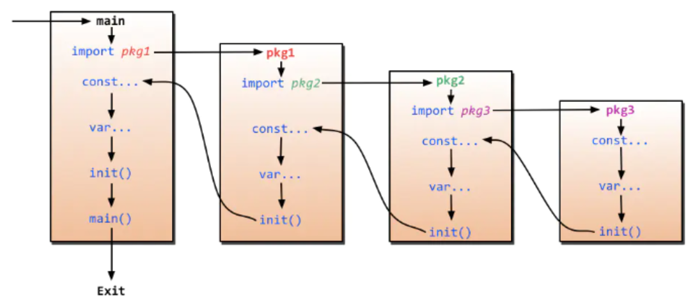

### Q1: 为啥需要私有`goproxy`？
#### 上下文
> 我们知道在大陆的网络环境是无法访问到`http://golang.org`等`google`的网站的。但在开发日常中使用的很多依赖包或系统包依赖都是在`google`的服务器上。为了解决无法加载依赖的问题，国内也有很多种解决方案。一种是使用`http://goproxy.io`或七牛主导的`http://goproxy.cn`。
在企业里，有很多情况是生产网络或测试网络环境是无法正常访问外网的，为了解决这个问题可能需要自己搭建一个`proxy`来管理依赖包。
#### 可选配置
```bash
export GOPROXY=https://mirrors.aliyun.com/goproxy/
export GOPROXY=https://proxy.golang.org,direct
export GOPROXY=https://goproxy.io
export GOPROXY=https://gonexus.dev
export GOPROXY=https://athens.azurefd.net
export GOPROXY=https://gocenter.io
export GOPROXY=https://goproxy.cn
```
### Q2: `Make`和`New`的异同？
- slice、map和channel，使用make
- array、struct和所有的值类型，使用new
> 内置函数 new 计算类型的⼤小，为其分配零值内存，返回指针。⽽ make 会被编译器翻译成具体的创建函数，由其分配内存和初始化成员结构，返回对象⽽⾮指针。new和make都是在堆上分配内存，只是行为有所不同。new分配完后会返回指向其的内存地址(指针)，make是返回整个数值/对象。

### Q3: 数组和切片陷阱
#### 陷阱一
```golang
func foo(a [2]int) {
	a[0] = 200
}

func main() {
	a := [2]int{1, 2}
	foo(a)
	fmt.Println(a)
}
```
改
```go
func foo(a *[2]int) {
	(*a)[0] = 200
}

func main() {
	a := [2]int{1, 2}
	foo(&a)
	fmt.Println(a)
}
```
或
```go
func foo(a []int) {
	a[0] = 200
}

func main() {
	a := []int{1, 2}
	foo(a)
	fmt.Println(a)
}
```
#### 陷阱二
```go
func foo(a []int) {
	a = append(a, 1, 2, 3, 4, 5, 6, 7, 8)
	a[0] = 200
}

func main() {
	a := []int{1, 2}
	foo(a)
	fmt.Println(a)
}
```
改
```go
func foo(a []int) []int {
	a = append(a, 1, 2, 3, 4, 5, 6, 7, 8)
	a[0] = 200
	return a
}

func main() {
	a := []int{1, 2}
	a = foo(a)   // 可读性更好
	fmt.Println(a)
}
```
或
```go
func foo(a *[]int) {
	*a = append(*a, 1, 2, 3, 4, 5, 6, 7, 8)
	(*a)[0] = 200
}

func main() {
	a := []int{1, 2}
	foo(&a)
	fmt.Println(a)
}
```
### Q4: for vs for...range的性能问题
> 与 for 不同的是，range 对每个迭代值都创建了一个拷贝。因此如果每次迭代的值内存占用很小的情况下，for 和 range 的性能几乎没有差异，但是如果每个迭代值内存占用很大，两者的差距就很明显了.
#### 陷阱一
```go
// for 语句中的迭代变量在每次迭代中都会重用, 即 for 中创建的闭包函数接收到的参数始终是同一个变量, 在`goroutine`开始执行时都会得到同一个迭代值
func main() {
    data := []string{"one", "two", "three"}

    for _, v := range data {
        go func() {
            fmt.Println(v)
        }()
    }

    time.Sleep(3 * time.Second)
    // 输出 three three three
}
```
改
```go
func main() {
    data := []string{"one", "two", "three"}

    for _, v := range data {
        vCopy := v
        go func() {
            fmt.Println(vCopy)
        }()
    }

    time.Sleep(3 * time.Second)
    // 输出 one two three
}
```
或
```go
func main() {
    data := []string{"one", "two", "three"}

    for _, v := range data {
        go func(in string) {
            fmt.Println(in)
        }(v)
    }

    time.Sleep(3 * time.Second)
    // 输出 one two three
}
```
### Q5: 字符串如何实现高效拼接?
> 一般我们拼接字符串时，会使用如下几种方式：
>
> - 使用操作符`+`，此方式最差
> - 使用`fmt.Sprintf`
> - 使用`strings.Builder`，此方式最佳
> - 使用`bytes.Buffer`
> - 使用`[]byte`
> 感兴趣的朋友，可以使用`benchmark`做下测试

### Q6: 常见导致`Go`程序`OOM`的情况
- 递归调用函数导致栈溢出
- `Goroutine`永久不退出，单个协程一般占4k，若堆积，就会导致`OOM`

### Q7: 如何退出协程?
> 超时陷阱
```go
func doBadthing(done chan bool) {
	time.Sleep(time.Second)
	done <- true
}

func timeout(f func(chan bool)) error {
	done := make(chan bool)
	go f(done)
	select {
	case <-done:
		fmt.Println("done")
		return nil
	case <-time.After(time.Millisecond):
		return fmt.Errorf("timeout")
	}
}
timeout(doBadthing)
```
_上述`doBadthing`协程，永久不会退出，会死锁的，针对上述问题，可以有哪些解决办法?_
- 思路一：保证协程能够执行完毕，不至于一直阻塞，可以给`channel`设置缓冲区
  eg: `done := make(chan bool, 1)`
- 思路二：仿照主函数`timeout`，也利用`select`来尝试发送，发送失败也能理解返回
```go
func doGoodthing(done chan bool) {
	time.Sleep(time.Second)
	select {
	case done <- true:
	default:
		return
	}
}
```

### Q8: 可以强制`kill`掉`goroutine`吗?
_答案是不能，`goroutine`只能自己退出，而不能被其他`goroutine`强制关闭或者杀死_

### Q9: 如何优雅正确的关闭通道?
> 我们知道一个已经关闭的channel，如果尝试再次close，会导致panic，虽然可以通过recover使程序恢复正常，但很粗鲁；作为文明人，自然要礼貌.
```go
type MyChannel struct {
	C    chan T
	once sync.Once
}
func NewMyChannel() *MyChannel {
	return &MyChannel{C: make(chan T)}
}
func (mc *MyChannel) SafeClose() {
	mc.once.Do(func() {
		close(mc.C)
	})
}
```

### Q10: 请列举一些你所知道的内置函数?
- len、cap
- close、copy、append
- panic、recover
- new、make

### Q11: Go语言的执行过程是? 或者说init函数的执行时机是?

_init函数是Go程序初始化的一部分，而Go程序的初始化先于main函数；runtime会在运行时解析包依赖关系，依次完成初始化，执行顺序如下：_
```shell script
$ import –> const –> var –> init() –> main()
# 每个包首先初始化包作用域的常量和变量（常量优先于变量），然后执行包的 init() 函数。
# 同一个包，甚至是同一个源文件可以有多个 init() 函数。
# init() 函数没有入参和返回值，不能被其他函数调用，同一个包内多个 init() 函数的执行顺序不作保证
```

### Q12: map如何顺序读取?
_map是无序的，不能顺序读取，要想顺序读取，第一个要解决的问题就是，把ｋｅｙ变得有序，然后通过key取值。_

### Q13: 说出一个context包的用途
- 避免`Goroutine`内存泄漏
```go
func main() {
    ctx, cancel := context.WithCancel(context.Background())

    ch := func(ctx context.Context) <-chan int {
        ch := make(chan int)
        go func() {
            for i := 0; ; i++ {
                select {
                case <- ctx.Done():
                    return
                case ch <- i:
                }
            }
        } ()
        return ch
    }(ctx)

    for v := range ch {
        fmt.Println(v)
        if v == 5 {
            cancel()
            break
        }
    }
}
```
_下面的 for 循环停止取数据时，就用 cancel 函数，让另一个协程停止写数据。如果下面 for 已停止读取数据，上面 for 循环还在写入，就会造成内存泄漏。_

### Q14: 如何跳出for select循环?
_通常在for循环中，使用break可以跳出循环，但是注意在go语言中，for select配合时，break 并不能跳出循环_
```go
func ForSelectLoop(ch chan bool){
 EXIT:
    for  {
        select {
        case v, ok := <-ch:
            if !ok {
                fmt.Println("close channel", v)
                break EXIT   //goto EXIT2
            }

            fmt.Println("ch val =", v)
        }
    }
    //EXIT2:
    fmt.Println("exit ForSelectLoop")
}
```

### Q15: 哪些情况，会导致go触发异常?
- NPE，空指针异常，对空指针做了解析引用
- 索引溢出/下标越界
- 除数为0
- 调用panic函数

### Q16: Slice的原理是啥?
> 切片是基于数组实现的，它的底层是数组，它自己本身非常小，是只有3个字段的struct类型：
>
> - 指向底层数据的指针
> - 切片的长度
> - 切片的容量

### Q17: Map的底层实现是基于什么数据结构?
`散列表`

### Q18: 多个defer函数同时存在时，程序会如何处理?
- `先进后出，后进先出的栈处理方式`
- `defer`在`return`语句之后执行，但在函数退出之前，`defer`可以修改返回值

### Q19: 空Select有什么用，如何避免死锁?
- 阻塞主协程
- 主线程内，存在其他运行的协程即可

### Q20: 空结构体struct{}占内存空间吗，可以在哪些场景下使用
- `struct{}`不占用内存空间，`unsafe.Sizeof`可说明

实用场景
- 基于map实现set，对于集合来说，只需要map的键，而不需要值
- 不发送任何数据的信道，只用来通知子协程(goroutine)执行任务，或只用来控制协程并发度
- 仅包含方法的结构体，虽说可以为任意数据结构绑定方法，但其他类型都需要占用额外的内存空间

### Q21: Go里面，有异常类型的概念吗？
> Go 没有异常类型，只有错误类型（Error），通常使用返回值来表示异常状态

### Q22: 什么是 rune 类型?
> 正常ASCII码的所有值，只需要7bit就能全部表示，但只能表示英文字母在内的128个字符；为了统一世界上所有的语言，引入了Unicode编码，它是ASCII的超集；
> 它能表示所有字符，而Go里面，unicode称之为rune，是int32类型的别名；在Go语言中，字符串的底层表示是byte(8bit)序列，而非rune(32 bit)序列。
> Go的默认字符串编码方式是UTF8，一个汉字占3个字节。下面的输出，你看懂了吗?
```go
fmt.Println(len("Go一百问")) // 11
fmt.Println(len([]rune("Go一百问"))) // 5
```

### Q23: 字符串打印时，`%v`和`%+v`的区别
_%v 和 %+v 都可以用来打印 struct 的值，但%v 仅打印各个字段的值，%+v 还会打印各个字段的名称_

### Q24: Go中如何定义enum枚举值
_使用常量(const)来表示枚举值_
```go
type EnumType int32
const (
	XXXXX EnumType = iota
	YYYYY
	ZZZZZ
	DDDDD
)
```

### Q25: Go语言的局部变量是分配在栈上，还是堆上?
> 这个由编译器决定，当Go编译器检测到变量逃出其作用域(内存逃逸)时，就会将其分配到堆上，防止因函数调用结束，其对应的资源被释放，而出现变量无法被问题的问题
> 通常当变量的作用域没有超出函数范围时，变量就可以被分配到栈上，反之必须分配到堆上.
```go
func foo() *int {
	v := 11
	return &v
}

func main() {
	m := foo()
	println(*m) // 11
}
>```
foo() 函数中，如果 v 分配在栈上，foo 函数返回时，&v 就不存在了，但是这段函数是能够正常运行的。Go 编译器发现 v 的引用脱离了 foo 的作用域，会将其分配在堆上。因此，main 函数中仍能够正常访问该值。
```shell
$ go run -gcflags -m main.go   # 通过执行该命令，对程序做内存逃逸分析
```

### Q26: 请列举一些channel操作会导致panic的情况
- channel一旦关闭，就只能读，不能再写了，否则panic
- channel一旦关闭了，就不能关闭第二次，如何保证channel只被close一次呢？sync.Once可以
- 因channel缺少接收者和发送者，导致死锁，程序出现panic(导致panic不是必然现象，视情况而定)

### Q27: 什么是协程泄露，常见导致协程泄露的场景有哪些?
- channel缺少接收器，导致发送阻塞，协程始终无法退出；类似的还有：缺少发送器，导致接收阻塞，接收和发送总是互斥，相互等待
- 多个协程之间，存在资源竞争，出现死锁，相互等待，永远不退出
- 死循环，没有退出条件导致，或者退出条件始终得不到满足

### Q28: 如何防止Struct用纯值方式初始化变量? 而不指定变量名
> 可以在struct中，添加_ struct {}字段，这个没什么好说的，特殊用法，记住就好

### Q29: 回顾下channel的基本操作
```go
ch := make(chan int) // 不带缓冲区
ch := make(chan int, 10) // 带缓冲区，缓冲区满之前，即使没有接收方，发送方不阻塞
close(ch)  // 关闭channel
ch <- v  // 向通道发送值v
<-ch // 忽略接收值
v := <-ch // 接收值并赋值给变量 v
v, beforeClosed := <-ch  // 接收操作可以有 2 个返回值
len(ch)  // channel长度
cap(ch)  // channel容量
```
> beforeClosed 代表 v 是否是信道关闭前发送的。true 代表是信道关闭前发送的，false 代表信道已经关闭。如果一个信道已经关闭，<-ch 将永远不会发生阻塞，但是我们可以通过第二个返回值 beforeClosed 得知信道已经关闭，作出相应的处理。

### Q30: 优雅的Go开发
```go
1、定义时间变量
// BAD
delay := time.Second * 60 * 24 * 60
// VERY BAD
delay := 60 * time.Second * 60 * 24
// GOOD -- 30 * time.Second 比 time.Duration(30) * time.Second 更好
delay := 24 * 60 * 60 * time.Second
// BAD
var delayMillis int64 = 15000
// GOOD  -- 用 time.Duration 代替 int64 + 变量名
var delay time.Duration = 15 * time.Second
2、忽略返回值
_ = f() 比 f() 更好
3、信息打印
用 %+v 来打印数据的比较全的信息
4、不要在循环中使用 defer，否则会导致内存泄露：因为这些 defer 会不断地填满你的栈（内存）
5、不要忘记停止 ticker, 除非你需要泄露 channel
ticker := time.NewTicker(1 * time.Second)
defer ticker.Stop()
6、结构体的初始化，不要用new
sval := T{Name: "foo"}
sptr := &T{Name: "bar"}
```

### Q31: 结构体之间是可以比较的吗?
> 只有当结构体的所有字段均为可比较类型时，结构体的对象之间，才是可以比较的。以下类型均为不可比较类型：
>
> - `func() bool`   // 函数类型，不可比较
> - `map[string]string`    // map类型不可比较
> - `[]byte`        // 数组成员只有在数组元素可比较时才算可比较

### Q32: Go的runtime包有用过吗，有过哪些使用场景?
- runtime.GOMAXPROCS(4)    // 多核模式
- runtime.NumCPU()    // 获取逻辑cpu的数量
- runtime/debug      // 打印panic时的stack overflow信息
- runtime.Gosched()  // 让出时间片，先让别的协程执行，它执行完，再回来执行此协程
- runtime.GOROOT()    // 获取goroot目录
- runtime.GOOS       // 获取操作系统
- runtime.Goexit()   //终止所在的协程

### Q33: 如何更改一个字符串? - 陷阱提问
> 字符串是不可变类型，是不能直接修改的；如果需要更改，就必须更改为byte类型或rune类型的数组或切片，然后再转为字符串类型。
```go
for 循环遍历字符串时，也有 byte 和 rune 两种⽅式
func main() {
 s := "abc汉字"
 for i := 0; i < len(s); i++ { // byte
    fmt.Printf("%c,", s[i])
 }
 fmt.Println()
 for _, r := range s { // rune
    fmt.Printf("%c,", r)
 }
}
```

### Q34: 有主动关闭过http连接吗，为啥要这样做?
> 有关闭，因为不关闭可能会导致程序消耗完 socket 描述符。可选的关闭方式有：
>
> - 直接设置请求变量的 Close 字段值为 true，每次请求结束后就会主动关闭连接。设置 Header 请求头部选项 Connection: close，然后服务器返回的响应头部也会有这个选项，此时 HTTP 标准库会主动断开连接
> ```go
> req, err := http.NewRequest("GET", "https://github.com", nil)
> req.Close = true  // 或者是 req.Header.Add("Connection", "close")
>```
> - 创建一个自定义配置的 HTTP transport 客户端，用来取消 HTTP 全局的复用连接
> ```go
> ts := http.Transport{DisableKeepAlives: true}
> client := http.Client{Transport: &ts}
> client.Get("https://github.com")
>```

### Q35: interface之间是可以相互比较的吗?
我们知道，在Go语言中，interface的内部实现包含了两个字段，类型T和值V，interface之间是可以使用 == 或 != 进行比较的。而两个interface相等有以下两种情况：
- 两个`interface`均等于`nil`(此时`V`和`T`都处于`unset`状态)
- 类型`T`相同，且对应的值`V`相等。
```go
type Person struct {
	Name string
}

type Human interface{}

func main() {
	var per1, per2 Human = &Person{"John"}, &Person{"John"}
	var per3, per4 Human = Person{"John"}, Person{"John"}
	fmt.Println(per1 == per2) // false
	fmt.Println(per3 == per4) // true
}
```
per1 和 per2 对应的类型是`*Person`，值是`Person`结构体的地址，两个地址不同，因此结果为`false`
per3 和 per4 对应的类型是`Person`，值是`Person`结构体，且各字段相等，因此结果为`true`
> 从这里，我们也能发现：两个接口值比较时，会先比较T，再比较V；那么interface和非interface之间要如何比较呢?
```go
func main() {
	var p *int = nil
	var i interface{} = p
	fmt.Println(i == p) // true  - ①
	fmt.Println(p == nil) // true  - ②
	fmt.Println(i == nil) // false   - ③
}  // 接口值与非接口值比较时，会先将非接口值尝试转换为接口值，再比较
/*
   ①中，i被p赋值后，其内部字段为(T=*int, V=nil)；p转换为接口也是(T=*int, V=nil)
   ②中，p与nil直接比较值，都是nil，所以相等
   ③中的nil转换为接口 (T=nil, V=nil)，与i (T=*int, V=nil) 不相等
*/
```

### Q36: go语言中的引用类型包含哪些?
- slice
- map
- channel
- interface
